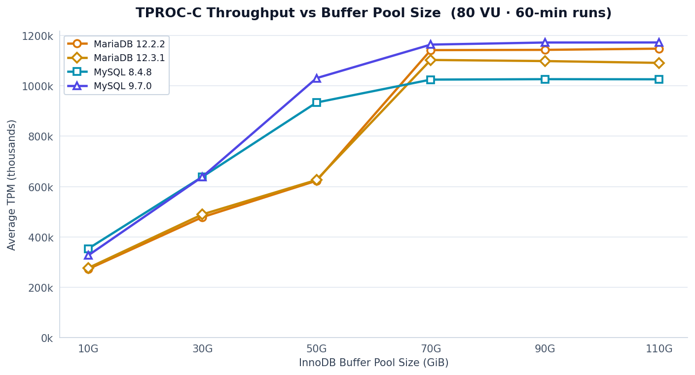
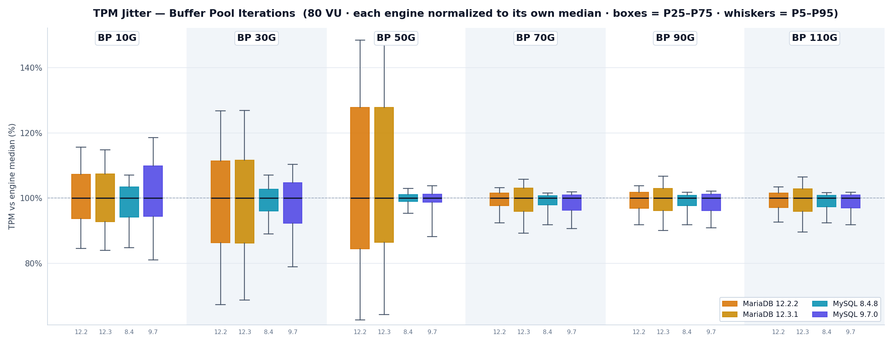
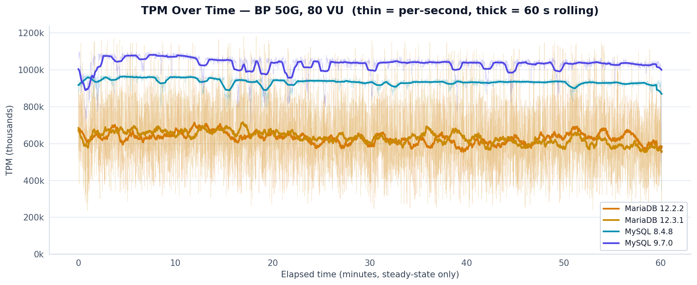
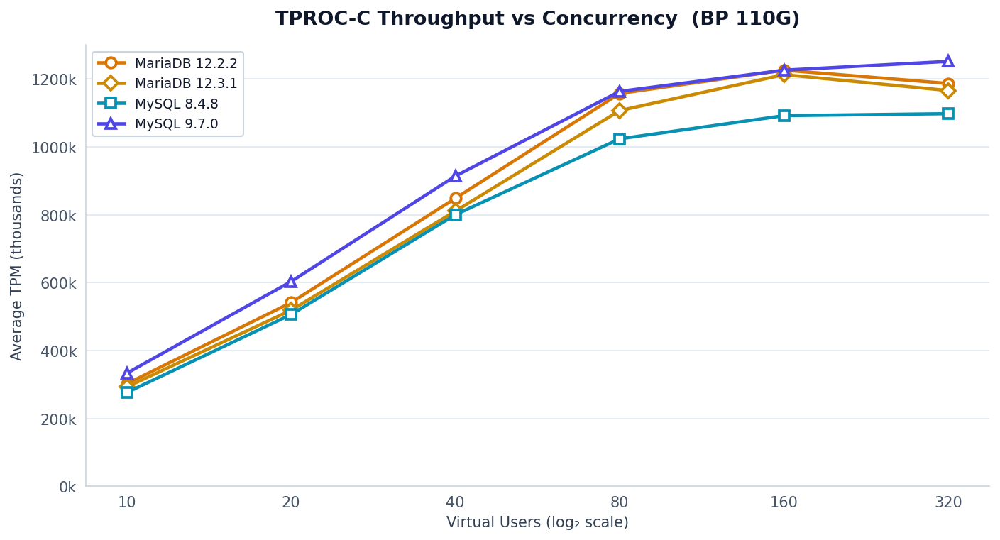
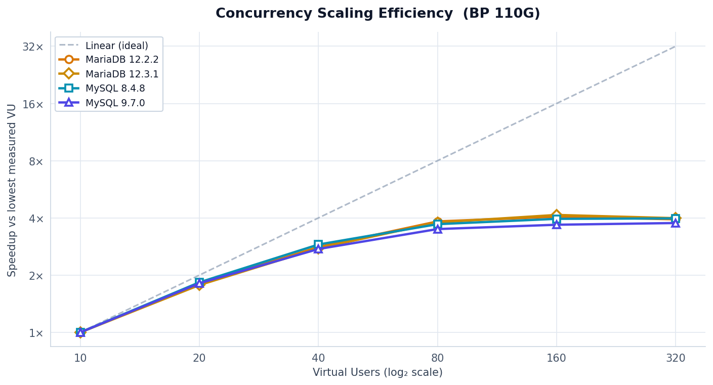
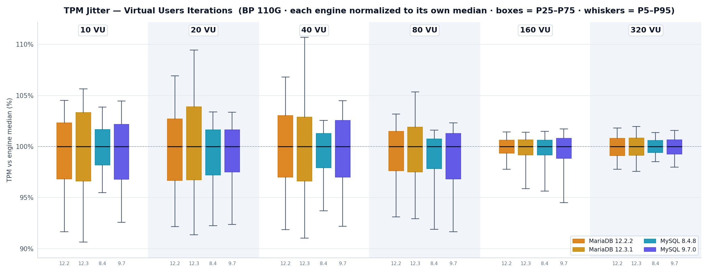

# TPC-C benchmark results — MySQL 8.4/9.7 vs MariaDB 12.2/12.3

Auto-generated summary of completed HammerDB 5.0 sweeps. See per-iteration
`results/<run>/bp-<size>GiB/run.json` for the full config manifest and
all telemetry files.

## Host

- Intel Xeon Gold 6230 × 2 (40 cores / 80 threads)
- 188 GiB RAM, 2 NUMA nodes
- NVMe: Intel SSDPE2KE032T8 (2.9 TB)
- Ubuntu 24.04 LTS, kernel 6.8.0-60-generic
- CPU governor pinned `performance`, idle capped at C1, THP = `never`,
  `vm.swappiness=1`

## Benchmark parameters

- HammerDB 5.0, TPC-C workload, `timed` driver
- 1000 warehouses (all-warehouse mode)
- 10-minute rampup + 60-minute measurement
- Cold buffer pool every iteration (`innodb_buffer_pool_load_at_startup=OFF`)
- Data dir restored from `/backup/<engine>-<ver>/` before each run
- `innodb_buffer_pool_instances = 2` (MySQL). MariaDB 11+ removed the
  option; its pool is always single-instance.

## Buffer-pool size sweep (80 VU)

Fixed 80 VU, sweep `innodb_buffer_pool_size` from 10 GiB to 110 GiB.

### NOPM

| BP (GiB) | MySQL 8.4.8 | MySQL 9.7.0 | MariaDB 12.2.2 | MariaDB 12.3.1-rc |
|---------:|------------:|------------:|---------------:|------------------:|
|       10 |     152,010 |     140,445 |        117,153 |           119,004 |
|       30 |     274,850 |     274,818 |        205,847 |           210,613 |
|       50 |     401,840 |     443,469 |        268,159 |           269,452 |
|       70 |     440,942 |     500,908 |        491,382 |           474,538 |
|       90 |     441,767 |     504,394 |        491,734 |           472,507 |
|      110 |     441,422 |     504,399 |        493,843 |           469,437 |

### TPM

| BP (GiB) | MySQL 8.4.8 | MySQL 9.7.0 | MariaDB 12.2.2 | MariaDB 12.3.1-rc |
|---------:|------------:|------------:|---------------:|------------------:|
|       10 |     353,125 |     326,322 |        272,108 |           276,483 |
|       30 |     638,556 |     638,562 |        478,234 |           489,355 |
|       50 |     933,531 |   1,030,408 |        622,939 |           626,108 |
|       70 |   1,024,559 |   1,163,566 |      1,141,606 |         1,102,582 |
|       90 |   1,026,225 |   1,171,792 |      1,142,685 |         1,098,103 |
|      110 |   1,025,733 |   1,172,021 |      1,147,448 |         1,090,956 |

### Per-engine peaks

| Engine | Peak NOPM | At BP |
|---|---:|---:|
| MySQL 9.7.0       | **504,399** | 110 GiB |
| MariaDB 12.2.2    | 493,843 | 110 GiB |
| MariaDB 12.3.1-rc | 474,538 | 70 GiB  |
| MySQL 8.4.8       | 441,767 | 90 GiB  |

### Key observations — BP sweep

- **Saturation at ~70 GiB** for all four engines; 90/110 GiB add <1%.
  The 1000-warehouse working set fits comfortably in 70 GiB.
- **At low BP (≤ 50 GiB)** MariaDB trails MySQL by 25–35%. MariaDB's I/O
  path benefits more from cache.
- **At saturation** MySQL 9.7 leads MySQL 8.4 by +14%, MariaDB 12.2 by
  +2%, MariaDB 12.3 by +6%.
- **MariaDB 12.3-rc regresses vs 12.2.2** by ~5% at every size ≥ 70 GiB.
- **MySQL 8.4 flatlines** at ~441k NOPM regardless of cache size beyond
  70 GiB.

Source runs:

| Engine | Dir |
|---|---|
| MySQL 8.4.8       | `results/20260420-203838/` |
| MySQL 9.7.0       | `results/20260421-184157-mysql9.7/` |
| MariaDB 12.2.2    | `results/20260424-074813-mariadb-12/` |
| MariaDB 12.3.1-rc | `results/20260423-092543-mariadb-12.3/` |

### Charts — BP sweep

## Virtual-user sweep (BP = 110 GiB)

Fixed BP=110 GiB, sweep VU from 10 to 320.

### NOPM

| VU  | MySQL 8.4.8 | MySQL 9.7.0 | MariaDB 12.2.2 | MariaDB 12.3.1-rc |
|----:|------------:|------------:|---------------:|------------------:|
|  10 |     118,834 |     143,380 |        129,954 |           125,879 |
|  20 |     217,838 |     259,728 |        233,002 |           223,234 |
|  40 |     344,405 |     393,468 |        365,259 |           349,033 |
|  80 |     440,656 |     500,849 |        498,137 |           476,630 |
| 160 |     470,076 |     527,696 |        527,684 |           522,104 |
| 320 |     472,555 |     538,799 |        510,958 |           502,018 |

### TPM

| VU  | MySQL 8.4.8 | MySQL 9.7.0 | MariaDB 12.2.2 | MariaDB 12.3.1-rc |
|----:|------------:|------------:|---------------:|------------------:|
|  10 |     276,116 |     333,019 |        301,942 |           292,497 |
|  20 |     506,079 |     603,331 |        541,276 |           518,776 |
|  40 |     800,144 |     914,072 |        848,592 |           810,835 |
|  80 |   1,023,746 |   1,163,664 |      1,157,551 |         1,107,155 |
| 160 |   1,092,135 |   1,226,158 |      1,226,157 |         1,212,899 |
| 320 |   1,097,938 |   1,252,012 |      1,186,987 |         1,166,107 |

### Per-engine peaks and saturation points

| Engine | Peak NOPM | VU at peak | Behaviour past peak |
|---|---:|---:|---|
| MySQL 9.7.0       | **538,799** | 320 | still rising (+2% from 160) |
| MariaDB 12.2.2    | 527,684 | 160 | regresses (−3.2% at 320) |
| MariaDB 12.3.1-rc | 522,104 | 160 | regresses (−3.8% at 320) |
| MySQL 8.4.8       | 472,555 | 320 | flat (+0.5% from 160) |

### Scaling shape (relative to VU=10)

| VU  | MySQL 8.4 | MySQL 9.7 | MariaDB 12.2 | MariaDB 12.3 |
|----:|----------:|----------:|-------------:|-------------:|
|  10 |  1.00×    |  1.00×    |  1.00×       |  1.00×       |
|  20 |  1.83×    |  1.81×    |  1.79×       |  1.77×       |
|  40 |  2.90×    |  2.74×    |  2.81×       |  2.77×       |
|  80 |  3.71×    |  3.49×    |  3.83×       |  3.79×       |
| 160 |  3.96×    |  3.68×    |  4.06×       |  4.15×       |
| 320 |  3.98×    |  3.76×    |  3.93×       |  3.99×       |

### Key observations — VU sweep

- **MySQL 9.7 wins uniformly** at every VU count, by +6–21% over 8.4 and
  +2–10% over MariaDB 12.2.
- **MariaDB peaks at 160 VU**, then regresses at 320. MySQL 9.7 keeps
  climbing past 160 and still gains 2% at 320.
- **At VU=80 and VU=160 MariaDB 12.2 matches or ties MySQL 9.7** — the
  gap is most visible at low concurrency (VU=10–40) where 9.7 leads by
  ~10%, and at VU=320 where MariaDB regresses.
- **MariaDB 12.3-rc trails 12.2.2** by 1–4% at every VU count.
- **MySQL 8.4 is consistently last** by 10–14% across the whole sweep.
- **Knee:** all engines saturate between VU=80 and VU=160. For this
  workload on 80 logical CPUs, VU=80 delivers 85–95% of peak.

Source runs:

| Engine | VU | Dir |
|---|---:|---|
| MySQL 8.4.8  | 10  | `results/20260422-211546-mysql8.4/` |
| MySQL 8.4.8  | 20  | `results/20260422-223308-mysql8.4/` |
| MySQL 8.4.8  | 40  | `results/20260422-235054-mysql8.4/` |
| MySQL 8.4.8  | 80  | `results/20260423-010846-mysql8.4/` |
| MySQL 8.4.8  | 160 | `results/20260423-022641-mysql8.4/` |
| MySQL 8.4.8  | 320 | `results/20260423-034444-mysql8.4/` |
| MySQL 9.7.0  | 10  | `results/20260422-094128-mysql9.7/` |
| MySQL 9.7.0  | 20  | `results/20260422-105836-mysql9.7/` |
| MySQL 9.7.0  | 40  | `results/20260422-121559-mysql9.7/` |
| MySQL 9.7.0  | 80  | `results/20260422-133342-mysql9.7/` |
| MySQL 9.7.0  | 160 | `results/20260422-145128-mysql9.7/` |
| MySQL 9.7.0  | 320 | `results/20260422-160938-mysql9.7/` |
| MariaDB 12.2.2 | 10  | `results/20260424-160142-mariadb-12/` |
| MariaDB 12.2.2 | 20  | `results/20260424-171915-mariadb-12/` |
| MariaDB 12.2.2 | 40  | `results/20260424-183655-mariadb-12/` |
| MariaDB 12.2.2 | 80  | `results/20260424-195432-mariadb-12/` |
| MariaDB 12.2.2 | 160 | `results/20260424-211217-mariadb-12/` |
| MariaDB 12.2.2 | 320 | `results/20260424-223007-mariadb-12/` |
| MariaDB 12.3.1-rc | 10  | `results/20260423-171937-mariadb-12.3/` |
| MariaDB 12.3.1-rc | 20  | `results/20260423-183711-mariadb-12.3/` |
| MariaDB 12.3.1-rc | 40  | `results/20260423-195440-mariadb-12.3/` |
| MariaDB 12.3.1-rc | 80  | `results/20260423-211213-mariadb-12.3/` |
| MariaDB 12.3.1-rc | 160 | `results/20260423-222952-mariadb-12.3/` |
| MariaDB 12.3.1-rc | 320 | `results/20260423-234730-mariadb-12.3/` |

### Charts — VU sweep

## Cross-sweep comparison at the sweet spot

Single row per engine at the best-performing BP (≥70 GiB) and VU (≥80):

| Engine | Best BP sweep | Best VU sweep | Delta |
|---|---:|---:|---:|
| MySQL 8.4.8       | 441,767 (90G, 80VU) | 472,555 (110G, 320VU) | +7.0% |
| MySQL 9.7.0       | 504,399 (110G, 80VU) | 538,799 (110G, 320VU) | +6.8% |
| MariaDB 12.2.2    | 493,843 (110G, 80VU) | 527,684 (110G, 160VU) | +6.9% |
| MariaDB 12.3.1-rc | 474,538 (70G, 80VU)  | 522,104 (110G, 160VU) | +10.0% |

All four engines gain ~7% from 80 VU to their optimal VU count, confirming
that 80 VU (= logical CPU count) is close to but not quite at saturation
for this workload.

## Not yet run

- MariaDB 11.8.6 — backup built but no benchmark iterations executed
- Instance-count sweep on MySQL 9.7 or MariaDB (only MySQL 8.4 has this)
